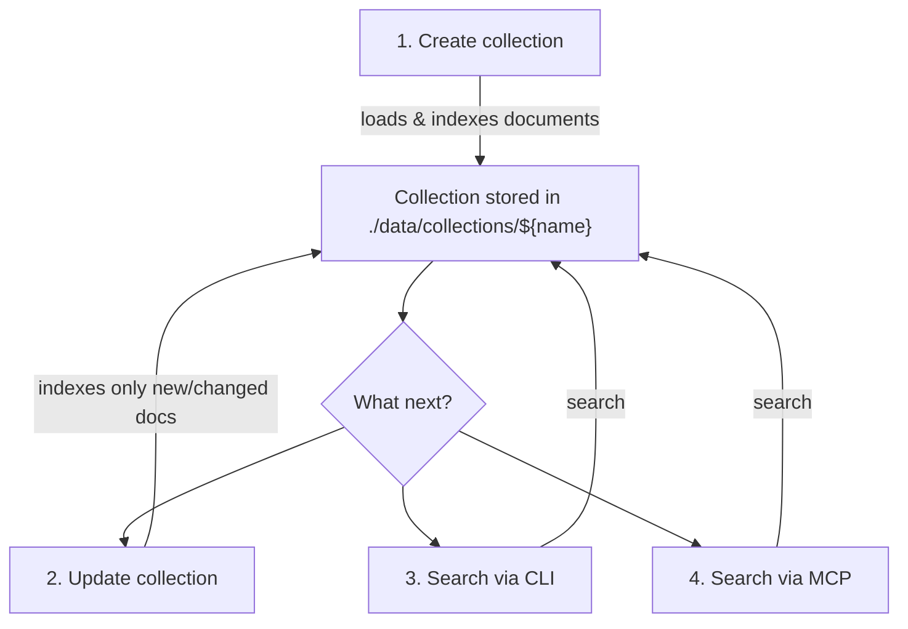
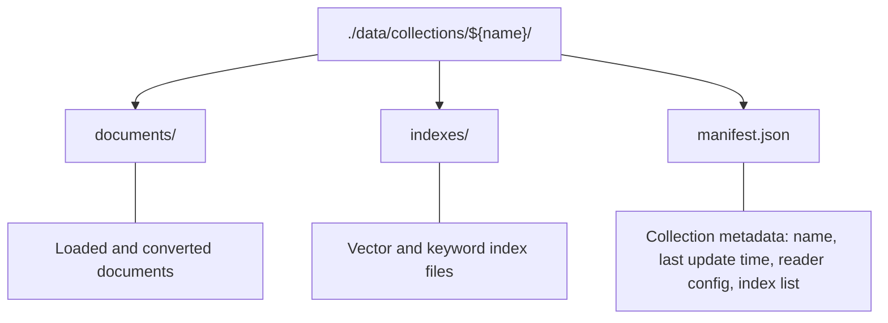

# Local Vector Search for Jira, Confluence & Files (with MCP support)

- [Overview](#overview)
- [Updates](#updates)
- [How it works](#how-it-works)
  - [Collection structure](#collection-structure)
  - [Indexers configuration](#indexers-configuration)
- [Setup](#setup)
  - [Authentication](#authentication)
  - [Create collection for Confluence](#create-collection-for-confluence)
  - [Create collection for Jira](#create-collection-for-jira)
  - [Create collection for local files](#create-collection-for-local-files)
  - [Update collection](#update-collection)
  - [Search](#search)
    - [Filtering by metafields](#filtering-by-metafields)
  - [Set up MCP](#set-up-mcp)
- [Good to know](#good-to-know)

## Overview

Index documents from Jira, Confluence, or local files into a local vector database and search them. All data stays on your machine.

**Key features:**
- Jira & Confluence (Server/Data Center and Cloud). Jira ticket = document, Confluence page = document
- Local files (.pdf, .pptx, .docx, etc.) via [Unstructured](https://github.com/Unstructured-IO/unstructured)
- **No data sent to third parties** (except when used as MCP with a remote AI agent)
- Hybrid search: vector search + BM25 keyword search, merged by Reciprocal Rank Fusion
- Incremental updates: no need to rebuild the full index each time
- Filter results by metafields (space, project, date, etc.)
- Ability to extend: add more data sources, search engines, embeddings, etc.

**Technologies:** [ChromaDB](https://github.com/chroma-core/chroma), [FAISS](https://github.com/facebookresearch/faiss), SQLite (BM25), [sentence-transformers](https://pypi.org/project/sentence-transformers/), [Unstructured](https://github.com/Unstructured-IO/unstructured), [LangChain](https://python.langchain.com/docs/introduction/)

More context: [Medium article](https://medium.com/@shnax0210/mcp-tool-for-vector-search-in-confluence-and-jira-6beeade658ba)

**Contacts:**
- Like it? Please star the repo
- Found a bug? [Open an issue](https://github.com/shnax0210/documents-vector-search/issues)
- Want to chat? [LinkedIn](https://www.linkedin.com/in/oleksii-shnepov-841447158/)

## Updates

### 2026/02/24 - support of more wide list of embedding models
Aded ability to use any embedding model form next [list](https://huggingface.co/models?pipeline_tag=sentence-similarity&library=sentence-transformers&sort=trending). Check [How it works](#how-it-works) section for details.

### 2026/02/24 — Faster Chroma deserialization (interface preserved)
- New Chroma index payload format stores/restores the underlying Chroma storage directly, avoiding full Python-level embeddings replay during load and end up with significant performance gain (x2-x20 depends from a case);
- Existing collections remain supported (backward-compatible load path for previous payload format).

### 2026/02/22 — SQLite BM25, Reciprocal Rank Fusion, common filter syntax
- BM25 keyword search via SQLite
- Multi-index search with Reciprocal Rank Fusion
- Common filter syntax for ChromaDB and SQLite: `--filter 'space = "SPACE_KEY" and lastModifiedAt > "2026-01-01"'`

### 2026/01/25 — ChromaDB and metafields filtering

ChromaDB added as default vector database (replaces FAISS) with metafield filtering support. To use FAISS instead, pass `--indexes "indexer_FAISS_IndexFlatL2__embeddings_all-MiniLM-L6-v2"` during collection creation.

## How it works



1. **Create** a collection — load and index documents from Jira, Confluence, or local files. Stored in `./data/collections/{name}`
2. **Update** — re-index only new or changed documents (much faster than full creation)
3. **Search** — find documents by text query via CLI
4. **MCP** — expose search as a tool for AI agents

### Collection structure



See `./main/core/documents_collection_creator.py` for creation/update details and `./main/core/documents_collection_searcher.py` for search details.

### Indexers configuration

When you create a collection, you can specify a list of `indexers` like: `--indexers "indexer_ChromaDb__embeddings_sentence-transformers_slash_all-MiniLM-L6-v2", "indexer_SqlLiteBM25"`. The indexers define what vector/keyword databases and embedding models are used. Database and embedding model are separated by `__`. For example:
- `indexer_ChromaDb__embeddings_sentence-transformers_slash_all-MiniLM-L6-v2` means that `ChromaDb` is used as vector database and [`sentence-transformers/all-MiniLM-L6-v2`](https://huggingface.co/sentence-transformers/all-MiniLM-L6-v2) is used as the embedding model. You can use any embedding model from next [list](https://huggingface.co/models?pipeline_tag=sentence-similarity&library=sentence-transformers&sort=trending), you only needs to add prefix `embeddings_` and replace slash symbols with `_slash_`. For example, if you want to use ChromaDb with [BAAI/bge-m3](https://huggingface.co/BAAI/bge-m3) embedder model, indexer name shoud be: `indexer_ChromaDb__embeddings_BAAI_slash_bge-m3`;
- `indexer_SqlLiteBM25` means that SqlLite BM25 is used as search engine.

You can define as many indexers as you want, their search results will be combined by Reciprocal Rank Fusion.

## Setup

1. Clone the repository
2. Install [uv](https://docs.astral.sh/uv/)
3. Run `uv sync` in the project root

### Authentication

Set environment variables before creating or updating Jira/Confluence collections (not needed for local files):

| Platform | Type | Environment Variables |
|---|---|---|
| Confluence Server/DC | Bearer token (recommended) | `CONF_TOKEN` |
| Confluence Server/DC | Login/Password | `CONF_LOGIN`, `CONF_PASSWORD` |
| Confluence Cloud | Email/API token | `ATLASSIAN_EMAIL`, `ATLASSIAN_TOKEN` ([get token](https://id.atlassian.com/manage/api-tokens)) |
| Jira Server/DC | Bearer token (recommended) | `JIRA_TOKEN` |
| Jira Server/DC | Login/Password | `JIRA_LOGIN`, `JIRA_PASSWORD` |
| Jira Cloud | Email/API token | `ATLASSIAN_EMAIL`, `ATLASSIAN_TOKEN` ([get token](https://id.atlassian.com/manage/api-tokens)) |

Cloud vs Server is auto-detected: URLs ending with `.atlassian.net` are treated as Cloud.

### Create collection for Confluence

```bash
uv run confluence_collection_create_cmd_adapter.py \
  --collection "confluence" \
  --url "${baseConfluenceUrl}" \
  --cql "${confluenceQuery}"
```

- `--collection` — name of the collection (used later for update/search). Data stored in `./data/collections/{name}`
- `--url` — Confluence base URL (e.g., `https://confluence.example.com` or `https://your-domain.atlassian.net`)
- `--cql` — Confluence query, e.g., `"(space = 'MySpace') AND (lastModified >= '2025-01-01')"`

### Create collection for Jira

```bash
uv run jira_collection_create_cmd_adapter.py \
  --collection "jira" \
  --url "${baseJiraUrl}" \
  --jql "${jiraQuery}"
```

- `--url` — Jira base URL (e.g., `https://jira.example.com` or `https://your-domain.atlassian.net`)
- `--jql` — Jira query, e.g., `"project = MyProject AND created >= -183d"`

### Create collection for local files

```bash
uv run files_collection_create_cmd_adapter.py --basePath "${pathToFolder}"
```

- Collection name defaults to the last folder name. Override with `--collection {name}`
- Unreadable files are skipped by default. Use `--failFast` to stop on first error
- Filter files with `--includePatterns "regex1" "regex2"` and `--excludePatterns "regex1" "regex2"`
- Uses [Unstructured](https://github.com/Unstructured-IO/unstructured) for parsing. Some formats may need [extra software](https://docs.unstructured.io/open-source/installation/full-installation#full-installation)

### Update collection

Only re-indexes new or changed documents.

```bash
uv run collection_update_cmd_adapter.py --collection "${collectionName}"
```

### Search

```bash
uv run collection_search_cmd_adapter.py \
  --collection "${collectionName}" \
  --query "How to set up react project locally"
```

- `--includeMatchedChunksText` — include matched text chunks in results
- `--filter` — filter by metafields (see below)
- `--rrfK` — RRF constant for multi-index fusion (default: `60`)

#### Filtering by metafields

Works with ChromaDB and SQLite BM25 indexes.

**Syntax:**
```
field operator "value" and/or field operator "value"
```

Operators: `=`, `!=`, `>`, `>=`, `<`, `<=`. Use `and` / `or` to join conditions (mixing both is not supported).

**Confluence metafields:**

| Field | Description |
|---|---|
| `space` | Space key |
| `createdAt` | Page creation date |
| `createdBy` | Creator email (lowercase) |
| `lastModifiedAt` | Last update date |

**Examples:**
```bash
--filter 'space = "SPACE_KEY"'
--filter 'space = "SPACE_KEY" and lastModifiedAt > "2026-01-01"'
--filter '(space = "SPACE_KEY1" or space = "SPACE_KEY2") and lastModifiedAt > "2026-01-01"'
```

**Jira metafields:**

| Field | Description |
|---|---|
| `project` | Project key |
| `type` | Issue type (Bug, Task, Story, ...) |
| `status` | Status (Open, In Progress, Done, ...) |
| `priority` | Priority (High, Medium, Low, ...) |
| `epic` | Epic or parent issue key |
| `assignee` | Assignee email (lowercase) |
| `createdAt` | Issue creation date |
| `createdBy` | Creator email (lowercase) |
| `lastModifiedAt` | Last update date |

**Examples:**
```bash
--filter 'project = "PROJ"'
--filter 'project = "PROJ" and lastModifiedAt > "2026-01-01"'
--filter '(project = "PROJ1" or project = "PROJ2") and lastModifiedAt > "2026-01-01"'
```

### Set up MCP

Add to your MCP config (e.g., `.vscode/mcp.json` for VS Code + GitHub Copilot):

```json
{
    "servers": {
        "search_${collectionName}": {
            "type": "stdio",
            "command": "uv",
            "args": [
                "--directory", "${fullPathToRootProjectFolder}",
                "run", "collection_search_mcp_stdio_adapter.py",
                "--collection", "${collectionName}"
            ]
        }
    }
}
```

- Replace `${collectionName}` and `${fullPathToRootProjectFolder}` with real values
- Use `--maxNumberOfChunks {number}` to control how many text chunks are returned (more = better search, but may exceed model context window)
- Use `--rrfK {number}` to tune Reciprocal Rank Fusion behavior for multi-index search
- Use `--filter` for metafield filtering ([details](#filtering-by-metafields))

**Prompt examples:**
- "Find info about AI use cases, search on Confluence, include all used links"
- "Find info about PDP carousel, search on Jira, include all used links"

## Good to know

- **Incremental updates** — only new/changed documents are re-indexed. Uses `lastModifiedDocumentTime` from `manifest.json` (minus 1 day buffer to avoid missing concurrent updates and possible issues with different time zones);
- **Caching** — Jira/Confluence collection creation caches downloaded documents in `./data/caches/{hash}`. Same parameters = same cache. If you need fresh data, either run an update after creation, or delete the cache folder manually;
- there are more parameters in scripts, use "--help" to get more.
